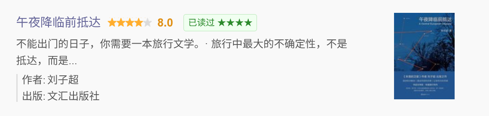

# 豆瓣广播：这个我标过

在豆瓣广播流（首页 + 成员 statuses 页）中，自动显示你对好友分享的书影音游戏的标记状态和评分。

## 截图

### 印章模式（默认）

| 已看过 + 星级 | 已想看 + ✓ |
|:---:|:---:|
|  |  |

### 标签模式

| 已读过 + 星级 | 已想看 |
|:---:|:---:|
|  |  |

通过 Tampermonkey 菜单「切换显示模式（印章 / 标签）」一键切换。

## 安装

[GreasyFork 安装页面](https://greasyfork.org/zh-CN/scripts/572857)

## 支持的条目类型

| 类型 | 标记状态 |
|------|----------|
| 书籍 | 已想读 / 已在读 / 已读过 |
| 影视 | 已想看 / 已在看 / 已看过 |
| 音乐 | 已想听 / 已在听 / 已听过 |
| 游戏 | 已想玩 / 已在玩 / 已玩过 |

## 特性

- 两种显示模式：印章（仿豆瓣 app 盖章效果）和标签（简洁 inline）
- 自动扫描页面条目链接，去重后批量查询；下拉加载的新广播也会自动标记
- 缓存：已标记 7 天，未标记 1 天
- 并发控制：最多 3 个请求，不触发限流
- 需登录豆瓣
